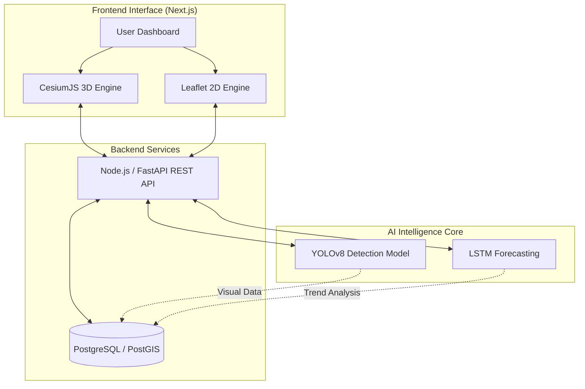

<div align="center">
  

  <br />
  <br />

  <h1 align="center">A.R.G.U.S.</h1>
  <p align="center">
    <strong>Advanced Geospatial Urban Intelligence & AI Prediction Platform</strong>
    <br />
    <br />
    <a href="https://argus-ashen2.vercel.app/"><strong>Explore the Live Platform »</strong></a>
  </p>

  <p align="center">
    
    
    
    
  </p>
</div>

<hr />

## 🌍 Overview

**ARGUS** is a state-of-the-art urban intelligence platform designed to empower city planners, municipalities, and citizens with real-time geospatial awareness. By combining high-performance 3D/2D rendering engines with predictive AI models, ARGUS detects, categorizes, and predicts urban hazards (potholes, structural damage, debris, exposed wiring) before they escalate.

---

## ✨ Mind-Blowing Features

- 🛰️ **Interactive 3D Digital Twin**: Powered by **CesiumJS**, seamlessly navigate a fully rendered 3D globe with real-time dynamic entity tracking.
- 🗺️ **High-Fidelity 2D Mapping**: Utilizing **React-Leaflet** and free **ESRI World Imagery** for high-resolution satellite context without restrictive API keys.
- 🎯 **Real-Time Geolocation**: High-accuracy GPS integration with adaptive `flyTo` camera panning and dynamic accuracy ellipses.
- 🧠 **AI Hazard Detection**: Automated computer vision pipelines that scan urban environments to identify and log infrastructural hazards instantly.
- 🔮 **Predictive AI Modeling**: Temporal forecasting models that predict the degradation of urban infrastructure based on historical and geospatial data.
- ⚡ **Zero-Latency Rendering**: Programmatic CDN loading bypasses traditional bundler bottlenecks (Turbopack/Webpack), delivering a massive 3D engine instantly via edge networks.

---

## 🧠 AI Integration: Detection & Prediction

ARGUS isn't just a map—it's a living, breathing intelligence system. Our dual-engine AI pipeline transforms raw visual and geospatial data into actionable urban insights.

### 1. Vision AI: Hazard Detection (YOLO / CNNs)
We employ state-of-the-art object detection architectures to analyze incoming telemetry (drone footage, street-level imagery, or user uploads). 
- **Classification**: Instantly classifies potholes, scattered garbage, construction zones, and exposed wires.
- **Geospatial Pinpointing**: Automatically binds detected anomalies to exact Cartesian and geographic coordinates.

### 2. Predictive AI: Degradation Forecasting (Time-Series)
Why fix a problem when you can prevent it? ARGUS utilizes spatio-temporal AI models to analyze hazard density over time.
- **Risk Heatmapping**: Predicts which urban sectors are most likely to develop critical infrastructural failures in the next 30, 60, or 90 days.
- **Resource Allocation**: Algorithmically suggests optimal routes and priorities for city maintenance crews.

---

## 🏗️ System Architecture



---

## 💻 Technology Stack

### Frontend & Rendering
* **Framework**: Next.js 16 (App Router), React 19
* **Language**: TypeScript
* **Styling**: Tailwind CSS, SCSS Modules
* **Geospatial Engines**: CesiumJS (3D), React-Leaflet (2D)
* **Icons**: Lucide React

### Backend & AI
* **API**: Node.js / Express (or FastAPI)
* **AI Models**: PyTorch / TensorFlow (YOLO, Time-Series Forecasting)
* **Database**: MongoDB / PostgreSQL (PostGIS)

### Deployment & CI/CD
* **Frontend Hosting**: Vercel Edge Network
* **Backend Hosting**: Render
* **Asset Delivery**: jsDelivr CDN

---

## 🚀 Getting Started

### Prerequisites
Make sure you have `Node.js` (v18+) and `npm` installed.

### Local Installation

1. **Clone the repository:**
   ```bash
   git clone https://github.com/m4n1kya/ARGUS.git
   cd ARGUS
   ```

2. **Navigate to the frontend and install dependencies:**
   ```bash
   cd frontend
   npm install
   ```

3. **Set up Environment Variables:**
   Create a `.env.local` file in the `frontend` directory:
   ```env
   NEXT_PUBLIC_API_BASE=http://localhost:5000
   # Optional: Add Cesium Ion Token for 3D terrain
   NEXT_PUBLIC_CESIUM_ION_TOKEN=your_token_here
   ```

4. **Run the development server:**
   ```bash
   npm run dev
   ```
   Open [http://localhost:3000](http://localhost:3000) to view the Command Centre.

---

<div align="center">
  <p>Engineered for the cities of tomorrow. <br/> Built with 💻 and ☕ by <strong>m4n1kya</strong>.</p>
</div>
