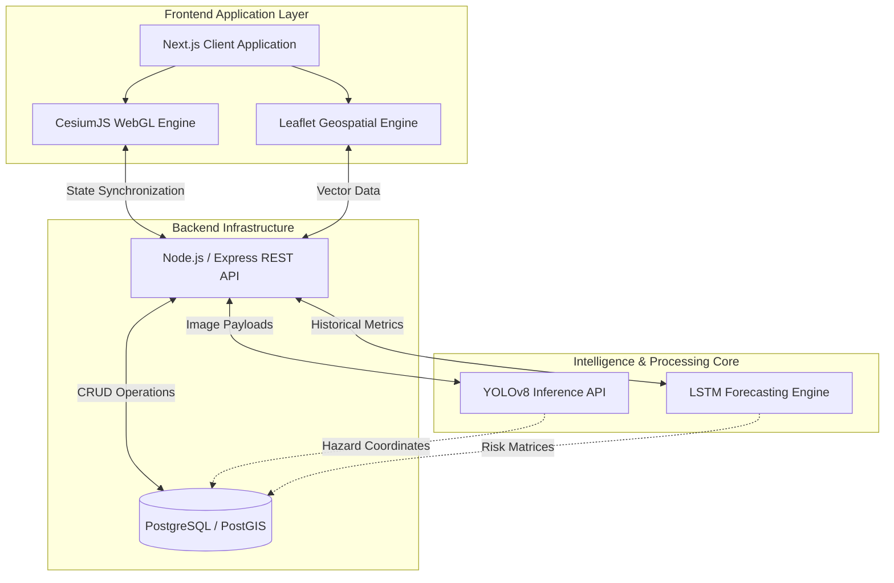

<div align="center">
  

  <br />
  <br />

  <h1 align="center">A.R.G.U.S.</h1>
  <h3 align="center">Advanced Geospatial Urban Intelligence & AI Prediction Platform</h3>
  
  <p align="center">
    <a href="https://argus-ashen2.vercel.app/"><strong>Explore the Live Platform »</strong></a>
  </p>

  <p align="center">
    
    
    
    
  </p>
</div>

<hr />

## System Overview

ARGUS is a comprehensive, state-of-the-art urban intelligence platform engineered to empower city planning authorities, municipal administrations, and civil engineers with real-time geospatial awareness. By converging high-performance 3D and 2D rendering engines with sophisticated predictive artificial intelligence models, ARGUS identifies, categorizes, and forecasts urban infrastructural degradation before critical failures occur.

The platform serves as a centralized command center, ingesting vast amounts of spatial data, performing high-speed inference on visual anomalies (such as road damage, structural degradation, and civic hazards), and mapping these data points onto a highly interactive digital twin of the urban environment.

---

## Core Capabilities & System Features

### Interactive 3D Digital Twin Integration
Powered by CesiumJS, the platform renders a high-fidelity 3D globe that seamlessly integrates geographic data, terrain models, and dynamic entity tracking. This allows for spatial visualization of infrastructure on a macro and micro scale, offering decision-makers a comprehensive view of the urban topography.

### High-Fidelity 2D Geospatial Mapping
Utilizing React-Leaflet alongside ESRI World Imagery, ARGUS provides high-resolution, hardware-accelerated 2D satellite context. This module is optimized for rapid panning, zooming, and layering of dense datasets without relying on restrictive, rate-limited mapping APIs.

### Real-Time Telemetry and Geolocation
The system features high-accuracy GPS integration, leveraging browser-native Geolocation APIs. It implements adaptive `flyTo` camera panning algorithms and renders dynamic accuracy ellipses to provide real-time spatial context for field agents and mobile operators.

### Asynchronous Asset Delivery & Zero-Latency Rendering
To circumvent the bundling limitations of modern JavaScript compilers (such as Webpack and Turbopack) when handling massive 3D engines, ARGUS utilizes a programmatic CDN loading strategy. This ensures that heavy WebGL assets are delivered instantaneously via edge networks, resulting in zero-latency initialization.

---

## Artificial Intelligence Pipeline

ARGUS elevates standard geospatial mapping by integrating a dual-engine artificial intelligence pipeline. This pipeline transforms raw visual telemetry and historical spatial data into actionable, predictive urban insights.

### 1. Vision Intelligence: Automated Hazard Detection
The platform employs state-of-the-art object detection architectures, primarily utilizing Convolutional Neural Networks (CNNs) based on the YOLO (You Only Look Once) framework.
- **Real-Time Classification:** The model processes incoming visual telemetry—ranging from drone footage and municipal vehicle cameras to crowdsourced mobile imagery—and instantly classifies anomalies such as potholes, scattered debris, active construction zones, and exposed electrical wiring.
- **Geospatial Anchoring:** Upon detection, the inference engine extracts metadata to automatically bind identified anomalies to exact Cartesian and geographic coordinate systems, projecting them instantly onto the ARGUS dashboard.

### 2. Predictive Analytics: Spatiotemporal Forecasting
Moving beyond reactive maintenance, ARGUS utilizes Long Short-Term Memory (LSTM) networks and temporal forecasting models to analyze hazard density over time.
- **Risk Heatmapping and Degradation Modeling:** By analyzing historical data trends alongside environmental factors, the AI predicts which urban sectors exhibit the highest probability of infrastructural failure within subsequent 30, 60, or 90-day windows.
- **Resource Route Optimization:** The system algorithmicly calculates optimal maintenance routes and suggests priority tiers for municipal repair crews, maximizing resource efficiency and minimizing public disruption.

---

## Technical Architecture

The architecture of ARGUS is designed for high availability, rapid scaling, and strict separation of concerns between the presentation layer, the artificial intelligence inference core, and data persistence.



### Component Stack Breakdown

#### Frontend Presentation
* **Framework:** Next.js 16 (App Router paradigm), React 19
* **Language:** Strict TypeScript for end-to-end type safety
* **Styling:** Tailwind CSS integrated with modular SCSS for complex component scoping
* **Rendering Engines:** CesiumJS for 3D environments, React-Leaflet for 2D cartography

#### Backend Services
* **API Gateway:** Node.js running Express (or FastAPI for direct Python integration)
* **Machine Learning:** PyTorch and TensorFlow ecosystems for model training and inference
* **Persistence:** PostgreSQL enhanced with PostGIS for spatial queries and geometric data types

#### Infrastructure & Delivery
* **Frontend Hosting:** Vercel Edge Network
* **Backend Computing:** Render Cloud Platform
* **Content Delivery:** jsDelivr Global CDN for static WebGL dependencies

---

## Deployment & Installation Guide

### System Requirements
* Node.js (v18.0.0 or higher)
* npm (v9.0.0 or higher) or yarn equivalent
* Modern WebGL-compatible web browser

### Local Development Setup

1. **Repository Cloning:**
   ```bash
   git clone https://github.com/m4n1kya/ARGUS.git
   cd ARGUS
   ```

2. **Dependency Installation:**
   ```bash
   cd frontend
   npm install
   ```

3. **Environment Configuration:**
   Create a `.env.local` configuration file within the `frontend` directory to establish necessary API endpoints:
   ```env
   NEXT_PUBLIC_API_BASE=http://localhost:5000
   # Optional: Configure Cesium Ion Token for high-resolution 3D terrain
   NEXT_PUBLIC_CESIUM_ION_TOKEN=your_authentication_token
   ```

4. **Initialization:**
   ```bash
   npm run dev
   ```
   Access the local development server at `http://localhost:3000`.

---

<div align="center">
  <p>Engineered for the administration of tomorrow's infrastructure.</p>
</div>
